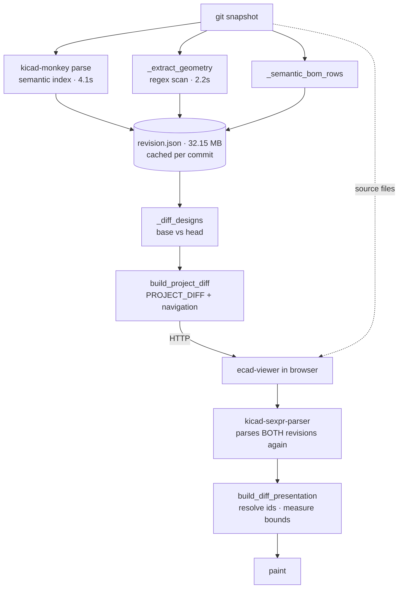
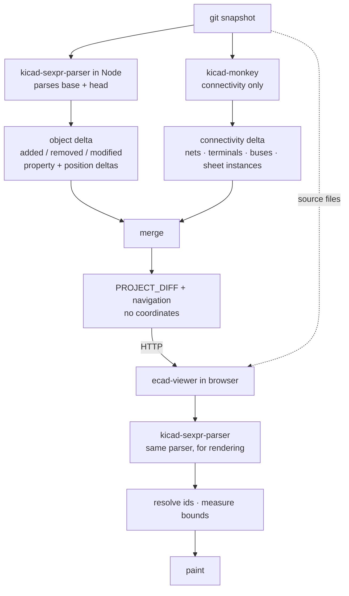

# Design Comparison: plan, revision 3

Status: proposal. Revision 3 re-architects around one parser instead of four.

Nothing in this revision is implemented. Two fixes and one instrumentation
change from earlier revisions have landed and are kept regardless of what
happens here — they are listed under "Already landed" at the end.

## Why revision 3 exists

Revisions 1 and 2 accepted, without examining it, that Prism must scan KiCad
files in Python. Under that assumption I proposed replacing
`_extract_geometry`'s regex scanning with a depth-aware object digest, built it,
and measured it. Two results killed the design:

1. The digest cost **3.6 s**, against the 2.2 s stage it was meant to replace.
2. `ecad-viewer`'s own parser — already a dependency, already `--platform=node`,
   already runnable on a Node runtime that is already in our image — parses the
   same files in **0.9 s** and returns typed objects rather than hashes.

The digest was Prism's *third* S-expression scanner, after kicad-monkey and
`_extract_geometry`. Building a fourth interpretation of the KiCad format was
never the goal; the goal was to have fewer.

**The correction: parse once, with `kicad-sexpr-parser`, on the server.**

## Measurements this plan rests on

All measured this session unless marked *(prior)*.

| | value |
| --- | ---: |
| `kicad-sexpr-parser`, 34.9 MB board | **639 ms** |
| `kicad-sexpr-parser`, 27 schematics / 15 MB | **250 ms** |
| Python object digest, same inputs | 3.6 s |
| kicad-monkey projection scan, board only | 10.4 s |
| `_extract_geometry` *(prior)* | 2.2 s |
| `build_semantic_index` *(prior)* | 4.1 s |
| `revision.json` *(prior)* | 32.15 MB |
| Fallback-bounds rate, 5 documents / 1,786 targets | 0.90% |
| Change-id inflation after the KIID_PATH fix | 1.002× / 1.021× |

The parsed model already carries what the diff needs: `footprint.path` and
`symbol.instances.projects[].paths[]` (KIID_PATH), `symbol.properties`, `pins`,
`dnp`, `mirror`, `at`, and — importantly — `zone.polygons` separately from
`zone.filled_polygons`, which is the authored/generated split the digest had to
hand-roll.

## Information flow

### Today

The same bytes are parsed three times per revision, and a fourth time per
browser session.

Two consequences we have measured rather than assumed:

- The geometry sidecar exists only to fill `KiCadItemChange.bbox`, and the
  viewer replaces those bounds 99.1% of the time. It is 28.96 MB of mostly
  discarded work.
- Server and browser disagree about what objects exist. All 16 unresolvable
  `SCH_PIN`s in the Phase 0B measurement **do** parse under
  `kicad-sexpr-parser`; they are missing from the viewer's *paint index*, not
  from the parse. Two notions of identity, two bugs.

### Target

The browser still parses, because painting needs geometry in the browser. What
changes is that it no longer recomputes anything the server computed, and both
sides use **the same parser**, so an object the server names is by construction
an object the viewer can resolve. That is a correctness property, not a
performance one, and it is what the 0.90% fallback rate is really about.

### Why kicad-monkey stays

`ecad-viewer` has no netlist: `netlist`, `connectivity` and `bus_expansion` all
grep to zero hits. Net inference over a schematic — which wires, labels and
pins form one net, across sheet instances and bus expansions — is graph work
only kicad-monkey does. That is tier 1 below, it is the reason Prism is not
merely a visual differ, and it does not move.

So: **two parsers, each for what only it can do.** Not four.

### Where the Node step runs

One process per compare, parsing both revisions and emitting **only the
delta**. Shipping 44k parsed objects across the Python/Node boundary as JSON
would hand back everything the parser wins; shipping ~2.5k changes will not.

At 0.9 s per revision, caching the parse is probably not worth its complexity —
a cold compare is ~1.8 s of parsing against a 4.1 s connectivity index. M1
measures this rather than assuming it. If it holds, per-revision geometry
caching disappears and `revision.json` shrinks to the connectivity index plus
BOM rows.

## The change model, unchanged from revision 2

| Tier | Owner | Kinds |
| --- | --- | --- |
| **1 — Connectivity** | kicad-monkey | net added/removed/renamed; net membership; pin reassignment; net class; sheet instance added/removed/re-pathed; bus membership |
| **2 — Identity & properties** | Node parser | component added/removed; `lib_id` swap; footprint change; property values *and* attributes (`at`, `hide`, `effects`); DNP / exclude flags; sheet assignment |
| **3 — Geometry & graphics** | Node parser detects, **viewer resolves bounds** | moved / rotated / mirrored / layer changed; tracks, vias, zones, graphics, text, dimensions |

Tier 3 gains what the hash-based digest could not give: the parser knows an
object *moved* rather than merely *changed*, for every kind, without a special
case for components.

## Milestones

Each milestone states what it proves, how it is measured, and what must be true
before the next one starts. Benchmarks reuse
`scripts/benchmark_design_compare.py` and the existing `benchmark.mark(scope=…)`
instrumentation rather than new tooling.

Fixed benchmark inputs, so numbers stay comparable across milestones:

- **A** — JTYU-OBC `8f71cfe → 4b0a39a` (27 schematics / 15 MB, 34.9 MB board)
- **B** — backplane `05a89dd → 934be89` (1,603 sch + 459 pcb changes, reused sheets)

### M0 — Baseline harness

*Proves the numbers in this plan are reproducible before anything moves.*

- Extend `benchmark_design_compare.py` to emit one row per stage for A and B:
  snapshot, semantic index, geometry, BOM, diff, project-diff, total.
- Record artifact sizes and object counts alongside times.
- **Target:** every figure in "Measurements" above reproduced within ±10%.
- **Gate:** two consecutive runs agree within 10%; otherwise fix the harness
  before trusting any later comparison.

### M1 — Node parse step, standalone

*Proves the parser runs in our image at the speed measured on the host, and
survives a real board without exhausting a worker.*

- A `scripts/ecad-parse.mjs` entry point: snapshot path in, object index out.
- Object index per object: `uuid`, `kind`, `documentPath`, `kiidPath`, `at`,
  `rotation`, `mirror`, `layer`, `net`, `properties`, plus a content hash for
  kinds with no meaningful field-level diff.
- **Benchmark:** wall clock and peak RSS for A and B, inside the backend image.
- **Target:** ≤1.2 s and ≤1.5 GB RSS for A. Object counts match the parser's
  own collection counts (982 footprints, 14,933 segments, … for A).
- **Gate:** RSS fits the worker's existing memory ceiling. If a 35 MB board
  needs more than the ceiling, decide streaming vs. raising the ceiling here,
  not later.

### M2 — Object delta in Node, shadow mode

*Proves the new delta agrees with the one we ship today, before anything
depends on it.*

- Node parses base + head and emits added / removed / modified with property
  and position deltas.
- Run alongside the existing pipeline; emit both; compare sets.
- **Benchmark:** delta wall clock; agreement rate against the current
  geometry-derived change sets, per kind.
- **Target:** ≤2.5 s for A. ≥99% agreement on component, track, via and zone
  add/remove. Every disagreement classified, not merely counted.
- **Gate:** disagreements are explained and are improvements (the ~1,034
  objects in neither index today should appear as *new* detections, not as
  regressions).

### M3 — Cut over; delete the geometry sidecar

*Proves the artifact and the wall clock actually improve.*

- Delete `_extract_geometry` and the geometry sidecar. Route `documentPath`,
  `kind` and `parentSourceId` — which the sidecar also carried — from the
  object index.
- Reduce `build_semantic_index` to connectivity: components now come from the
  parser. Measure whether the 4.1 s falls.
- **Benchmark:** `revision.json` size; compare wall clock; per-stage times.
- **Target:** artifact ≤6 MB (from 32.15 MB); wall clock ≤5.5 s (from ~8.3 s).
- **Gate:** `position_delta` still produced (it groups by net, so it needs a
  position for tracks, not just components); fallback-bounds rate no worse than
  0.90%; all 69 backend tests green.

### M4 — Fix identity resolution in the viewer

*Removes the reason bounds cannot yet be dropped.*

- The 16 failures are `SCH_PIN`s that parse but are absent from
  `build_paint_item_index`. Fix the paint index, not the parse.
- Re-measure across ≥8 documents including **a PCB document**, which has never
  been measured.
- **Benchmark:** fallback-bounds rate; `item-not-found` by type name.
- **Target:** 0% across all sampled documents, PCB included.
- **Gate:** M5 does not start until this is 0. At 0.90%, dropping bounds costs
  1 in 100 targets its ability to focus.

### M5 — Stop emitting bounds

*Completes "the backend never emits a coordinate".*

- Split the type: `NativeKiCadItemChange` keeps `bbox` required;
  `PrismItemChangeInput` makes it optional. Preparation becomes staged —
  validate, resolve, measure, then build targets.
- Unresolvable items become non-focusable change-list entries with a
  diagnostic, never `[0, 0, 0, 0]` targets at the origin.
- **Benchmark:** count of `bbox` fields in PROJECT_DIFF; artifact size.
- **Target:** zero bounds emitted; no regression in fallback rate.

### M6 — One comparison session, three views

*Removes the second rendering path.*

- `viewer.prepareComparison()` returning a session that owns both revisions and
  all presentation state; `setPresentation("composite" | "reference" |
  "comparison")`; side-by-side over two viewports.
- Delete `buildRevisionDiffPresentation`, `setRevisionDiffPresentation`,
  `selectRevisionDiff`, `previewRevisionDiff`.
- **Benchmark:** view-switch latency; `comparison-presentation-shell.tsx` line
  count; retained viewer instances; scene memory.
- **Target:** switch ≤150 ms with no reparse; shell under 1,200 lines (from
  2,092); one preparation path.
- **Gate:** measure whether one session can drive two viewports before
  committing to the two-scene model — this is the open scope risk.

### M7 — Semantic completeness

*Closes the gaps the measurements exposed.*

- Property *attributes* (`at`, `hide`, `effects`) — currently invisible.
- Sheet instance paths on **net** schematic refs, which is why label collisions
  survive on the backplane (8–121 entries depending on project).
- Buses and sheet instances as first-class tier-1 kinds.
- **Benchmark:** coverage count against the ~1,034 objects in neither index;
  residual change-id collisions.
- **Target:** zero unclassified objects; zero id collisions.

## Open questions, and which milestone answers each

| Question | Answered by |
| --- | --- |
| Does the parser fit the worker's memory ceiling on a 35 MB board? | M1 |
| Is per-revision parse caching worth its complexity at 0.9 s? | M1 |
| Does the Node delta agree with what we ship today? | M2 |
| How much of the 4.1 s semantic index is connectivity, and how much is component work the parser now does? | M3 |
| What is the fallback-bounds rate on a **PCB** document? | M4 |
| Why do parsed pins not reach the paint index? | M4 |
| Can one prepared session drive two side-by-side viewports? | M6 |
| Python↔Node boundary cost for a ~2.5k-change delta | M2 |

## Already landed, kept regardless

- **KIID_PATH change ids** (`35cd76f`). A reused hierarchical sheet is one file,
  so its instances share every symbol UUID; distinct components were collapsing
  onto one change id and only the last stayed selectable. Inflation 1.255× →
  1.002× (A), 1.311× → 1.021× (B).
- **Viewer generator-exhaustion fix** (`df92ecf`). `query_item_bboxes` is a
  generator that was spread twice, so per-visual bounds were never resolved and
  silently kept the caller's constant box. 0/255 visuals → 255/255.
- **Resolution instrumentation** (`fa3afb2`, `00fc93b`). Painted-bounds failure
  was previously silent; without it none of this plan's measurements exist.
- **Reproducible viewer build** (`0a657fa`).

## To revert

`design_object_digest.py` and its tests (`5da6993`). Superseded entirely by
M1–M2. Keeping it would leave a fourth parser in the tree.

## What revisions 1 and 2 got wrong

Kept deliberately — the corrections are the useful part.

| | claim | reality |
| --- | --- | --- |
| r1 | Four viewer instances | Three; Old/New aliases one |
| r1 | ~1.5 MB digest, 40 bytes/object | ~8 MB; ~90 bytes before interning |
| r1 | One prepared scene drives all three views | Composite holds no unchanged reference items, so it cannot render a reference pane |
| r1 | Make `bbox` optional | Splitting the type is safer than weakening the native contract |
| r1 | Add `getPreparedTargets()` | Redundant; the preparation already returns the map |
| r2 | The win is "one pass instead of 18" | The 18 regex passes cost 0.52 s and were never the bottleneck; a projection scan costs 10.4 s |
| r2 | Prism must scan files in Python | It must not. That assumption produced a fourth parser |
| r2 | Fallback-bounds rate is 0 | 0.90%, entirely `SCH_PIN` |
| r2 | Each changed component is emitted twice | Records were never duplicated; their ids collided |
